# Ruckus UI

Proyek ini merupakan **aplikasi demo antarmuka pengguna (UI)** berbasis Flutter. Aplikasi ini dibuat sebagai bagian dari tugas pemrograman antarmuka untuk menampilkan rancangan halaman login dan dashboard dengan tema gelap dan terang yang responsif.

## Fitur

- **Halaman Login**  
  Pengguna dapat memasukkan email/username dan password untuk masuk ke dalam aplikasi.

- **Dashboard**  
  Menampilkan elemen kartu dan banner dengan efek bayangan (shadow) yang elegan.  
  Mendukung mode terang dan gelap secara otomatis mengikuti tema sistem.

- **Desain Responsif**  
  Elemen UI seperti kartu dan banner memiliki batas lebar tertentu agar tampilan tetap proporsional pada layar desktop.

- **Transisi Halaman Halus**  
  Perpindahan antar halaman menggunakan animasi slide kiri dan kanan untuk pengalaman pengguna yang lebih dinamis.

## Teknologi

- **Flutter** — Framework utama untuk pengembangan UI.  
- **Dart** — Bahasa pemrograman yang digunakan dalam proyek ini.  
- **Material Design Components** — Untuk konsistensi gaya dan tema aplikasi.  

## Cara Menjalankan

1. Pastikan Flutter sudah terinstal di perangkat Anda.  
2. Clone repositori ini:
   git clone https://github.com/rinzler69-wastaken/ruckus_ui.git
3. Masuk ke folder proyek:
   cd ruckus_ui
4. Jalankan perintah berikut untuk memulai aplikasi:
   flutter run

## Catatan

    Proyek ini hanya bersifat demo UI, belum terhubung dengan sistem autentikasi atau database apa pun.
    Struktur dan tampilan dibuat untuk menonjolkan penerapan prinsip layout, shadow, responsivitas, dan tema dinamis pada Flutter.

Dibuat dengan ☕ dan sedikit chaos oleh Art Fazil.

## 🖼️ Gallery

<table align="center">
  <tr>
    <td align="center">
      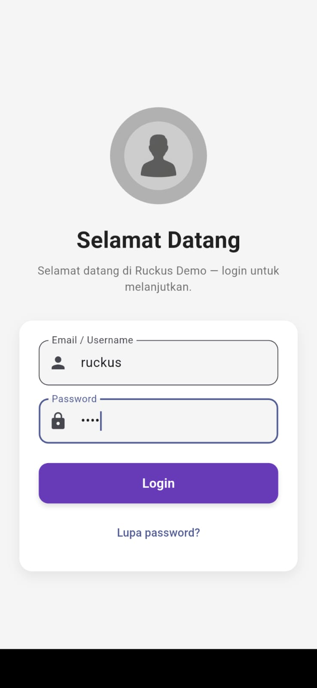
       Halaman <b>Login</b>
    </td>
  </tr>

  <tr>
    <td align="center">
      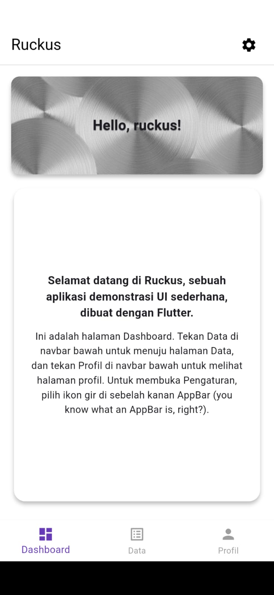
      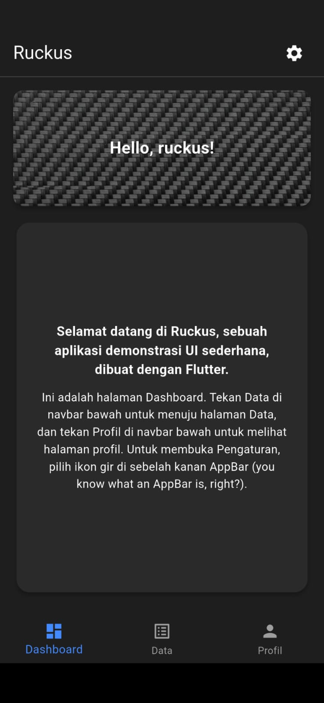
       Halaman <b>Dashboard</b>
    </td>
  </tr>

  <tr>
    <td align="center">
      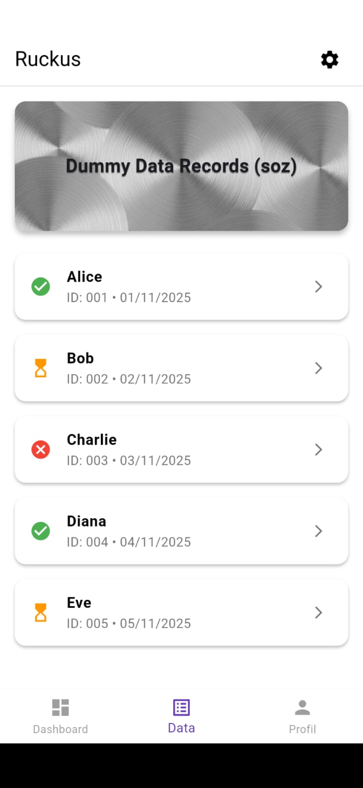
      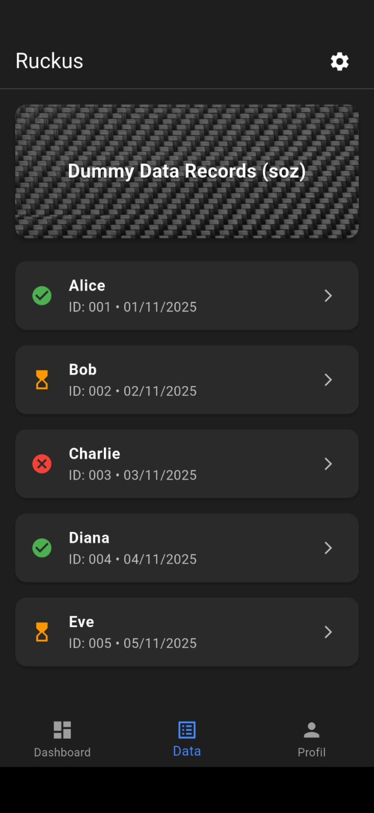
       Halaman <b>Data</b>
    </td>
  </tr>

  <tr>
    <td align="center">
      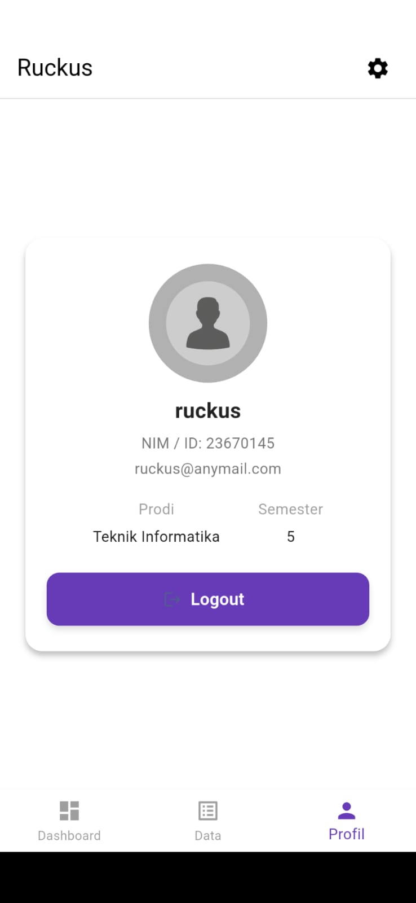
      
       Halaman <b>Profil</b>
    </td>
  </tr>

  <tr>
    <td align="center">
      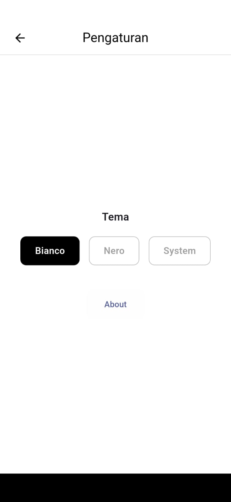
      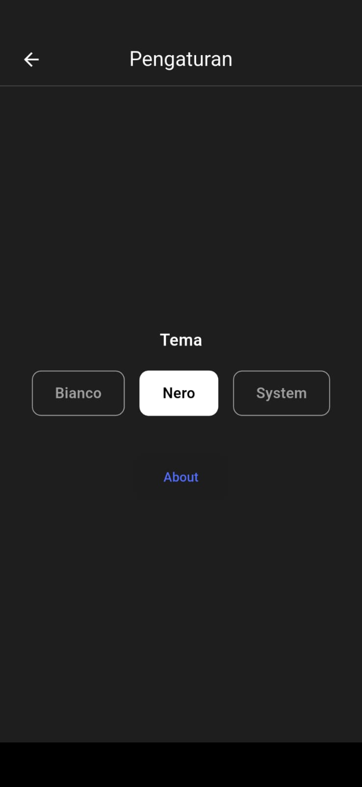
       Halaman <b>Pengaturan</b> — Tema <b>LBianco</b> & <b>Nero</b>
    </td>
  </tr>

  <tr>
    <td align="center">
      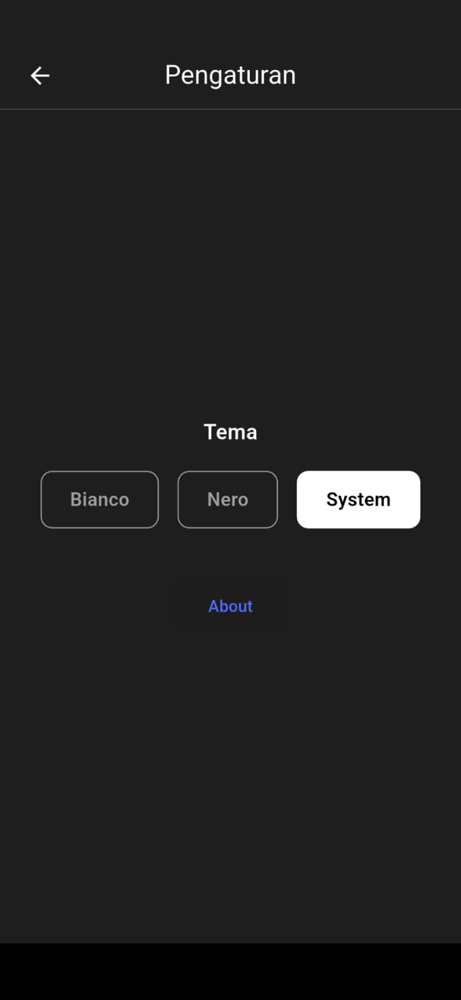
      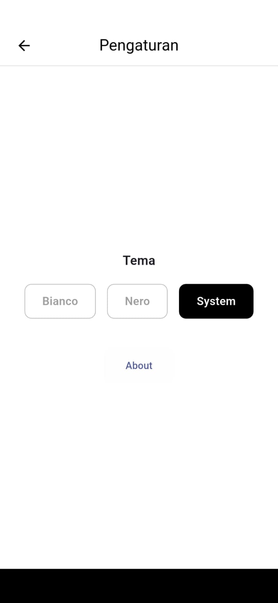
       <b>System Theme</b> mengikuti tema perangkat (Light/Dark)
    </td>
  </tr>

  <tr>
    <td align="center">
      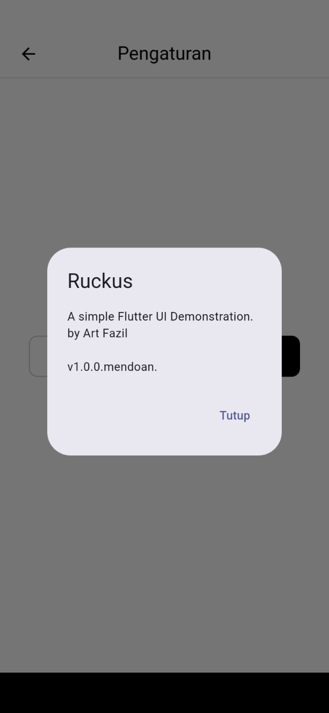
      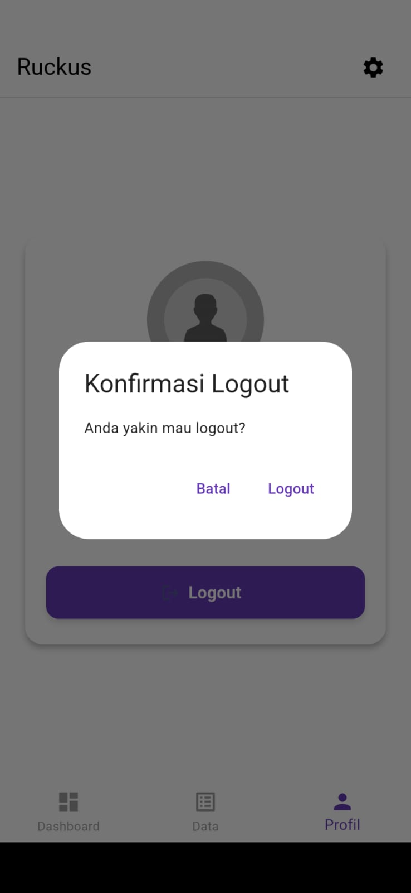
       Modal <b>About</b> & <b>Konfirmasi Logout</b>
    </td>
  </tr>
</table>
